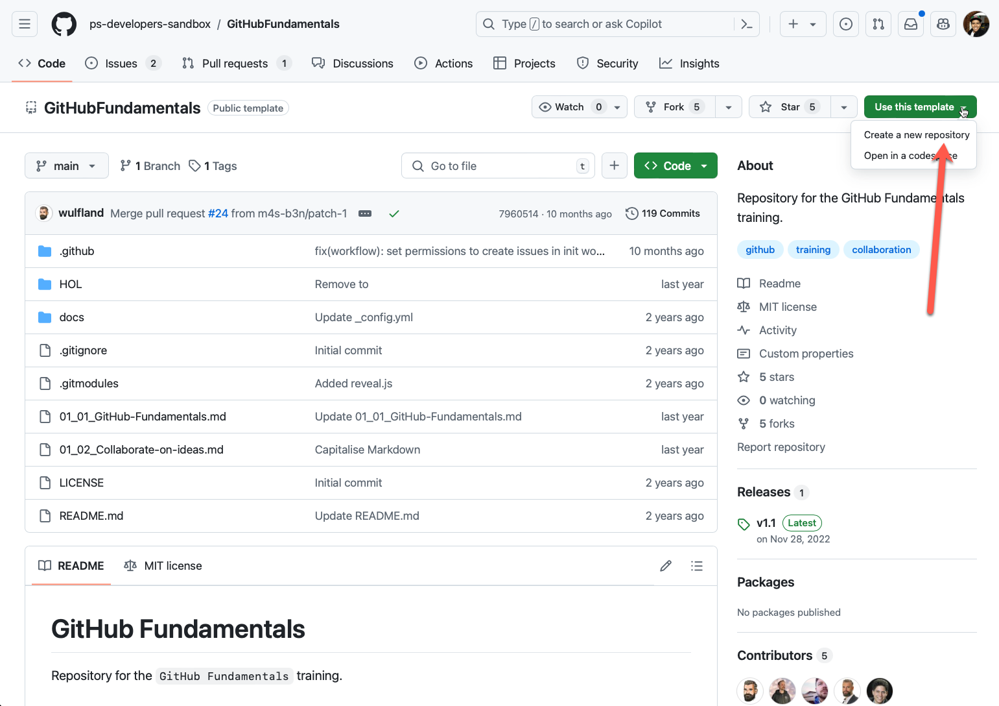
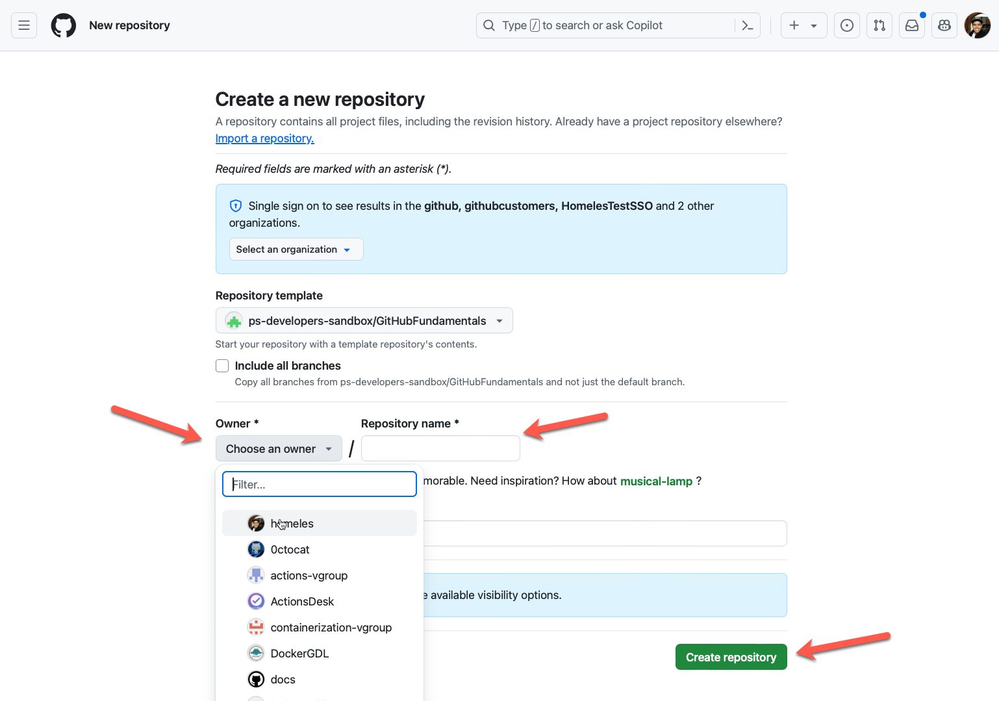

# 🔨 Hands-on: Working with Repositories

In this hands-on lab, you will learn how to create your First Repository in GitHub

The lab contains the following sections:
- [🔨 Hands-on: Working with Repositories](#-hands-on-working-with-repositories)
  - [Creating Repo](#creating-repo)
  - [Summary](#summary)

## Creating Repo

- [ ] Go to this repository https://github.com/ps-developers-sandbox/GitHubFundamentals and use it as a template to create a new repository for your class
- [ ] Click on the top right green button "Use this template", then "Create a new repo"

>**Note:**  
>If you have a free GitHub Account, make your repo public so you can follow all the labs

- [ ] Fill out the details, select the owner and new repository name, then click on "Create repository"

## Summary 

In this hands-on lab you've practiced how to create a repository using an existing repository template.

You can now continue with the next topic