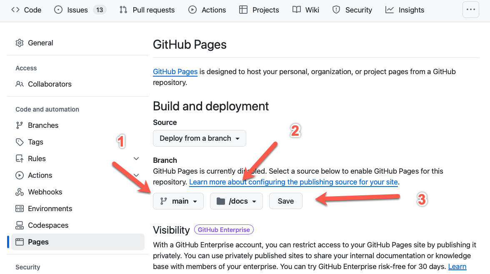
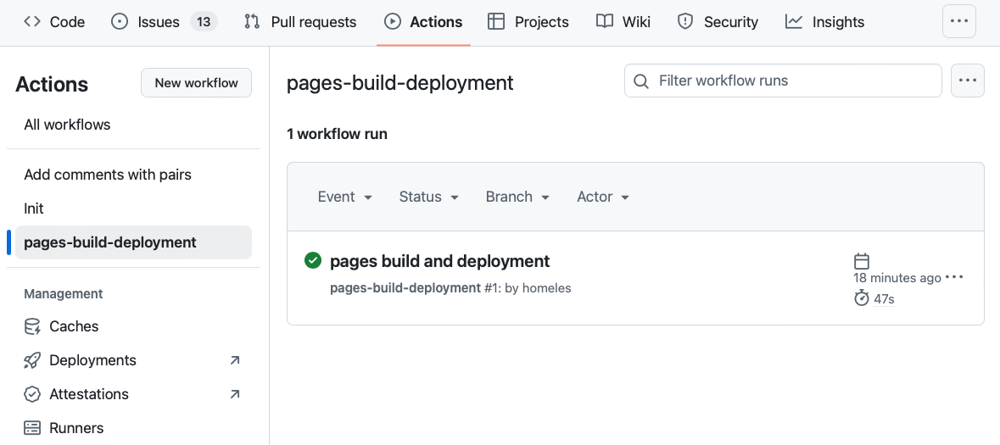
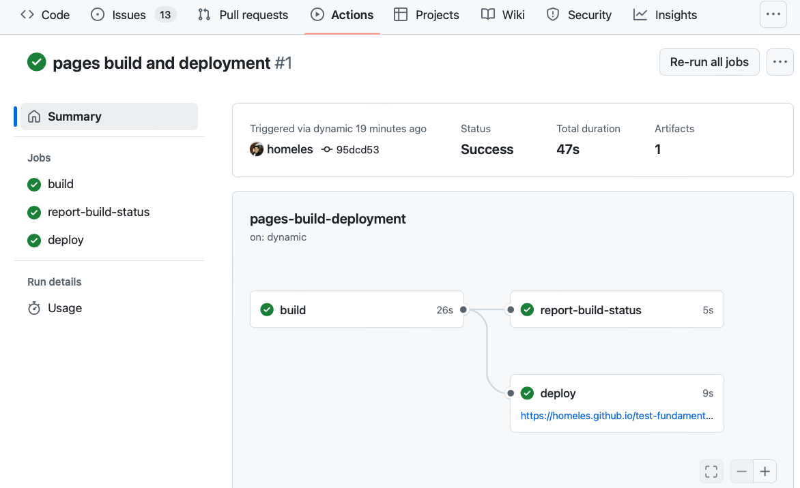
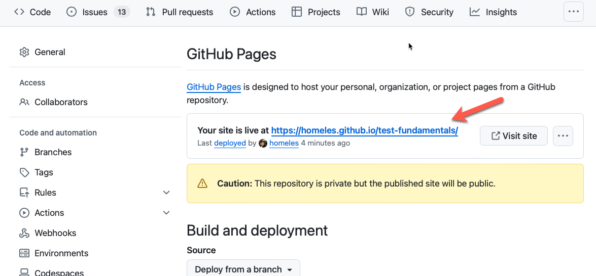
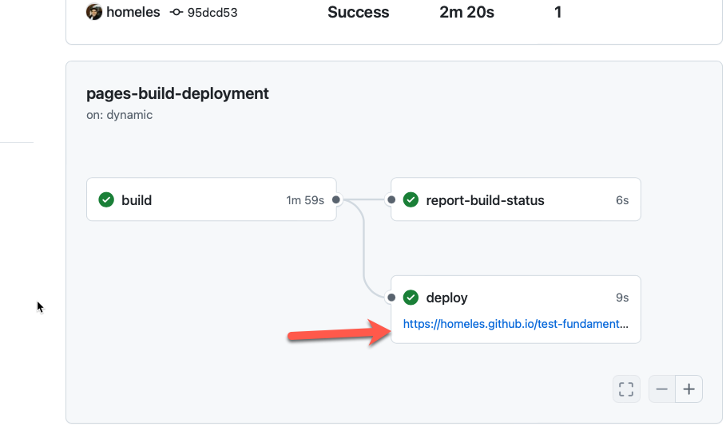
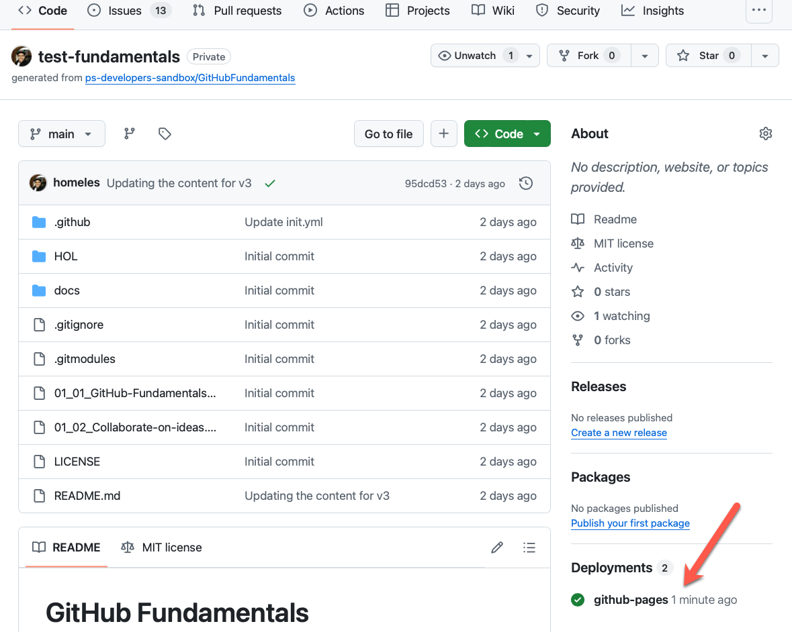
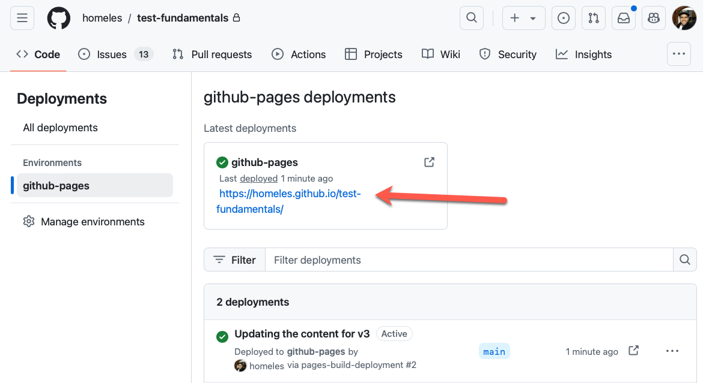

# 🔨 Hands-on: Generate and Deploy GitHub Pages

In this hands-on lab, you will practice working with GitHub Pages, how to generate them and how to deploy them so you can access using a browser

The lab contains the following sections:
- [🔨 Hands-on: Generate and Deploy GitHub Pages](#-hands-on-generate-and-deploy-github-pages)
  - [Creating a GitHub Page](#creating-a-github-page)
  - [Check the deployment](#check-the-deployment)
  - [Open Pages](#open-pages)
  - [Summary](#summary)

## Creating a GitHub Page

- [ ] Go to the pages configuration in the repository, `-> Settings -> Pages`
- [ ] Go to `Build and deployment -> Branch` option and select the `main` branch
- [ ] Then change the `/Root` configuration to `/docs` and hit __Save__

## Check the deployment

- [ ] GitHub pages are deployed using GitHub Actions, to check if the deployment was successful go to the Actions logs `-> Actions -> pages-build-deployment`

- [ ] Then click on the job `✅ pages build and deployment`, if the deploy job is green, means the GitHub Pages was successfully deployed.
  

## Open Pages

- [ ] To open the GitHub Page you have 3 options:
  - [ ] GitHub Pages Settings
  
  
  
  - [ ] GitHub Action
  
  
  
  - [ ] GitHub Home Repo

  

  

## Summary

In this hands-on lab you've practiced to work with GitHub Pages, how to create and access them.

You can now continue with the next topic
