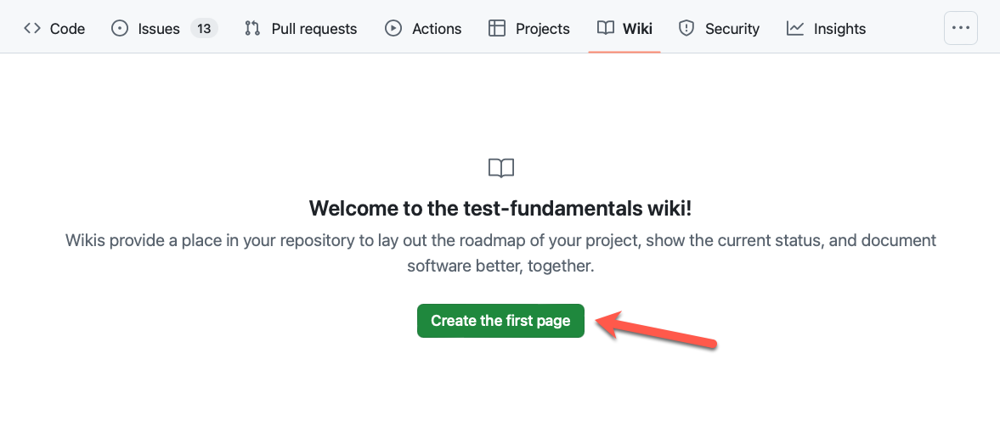
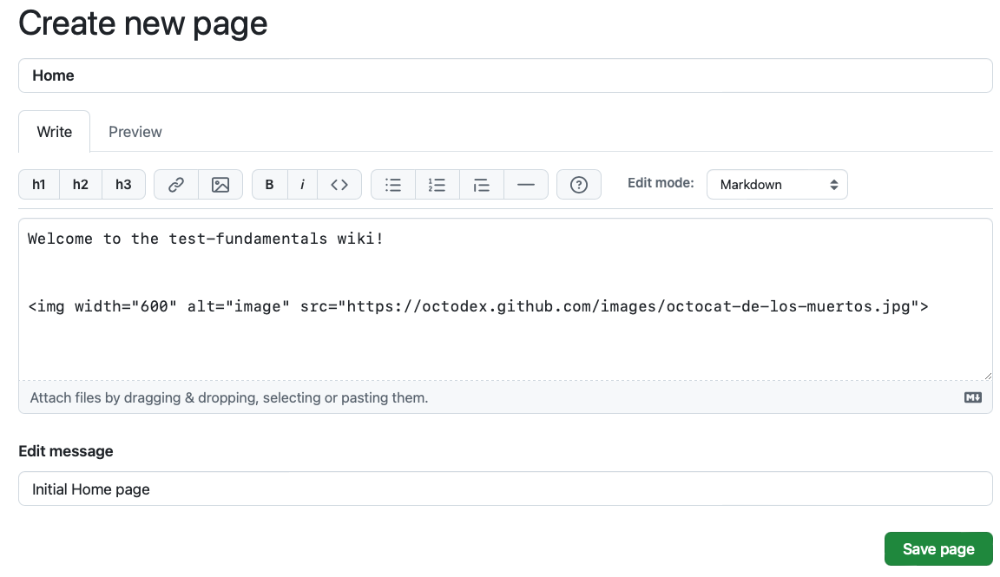
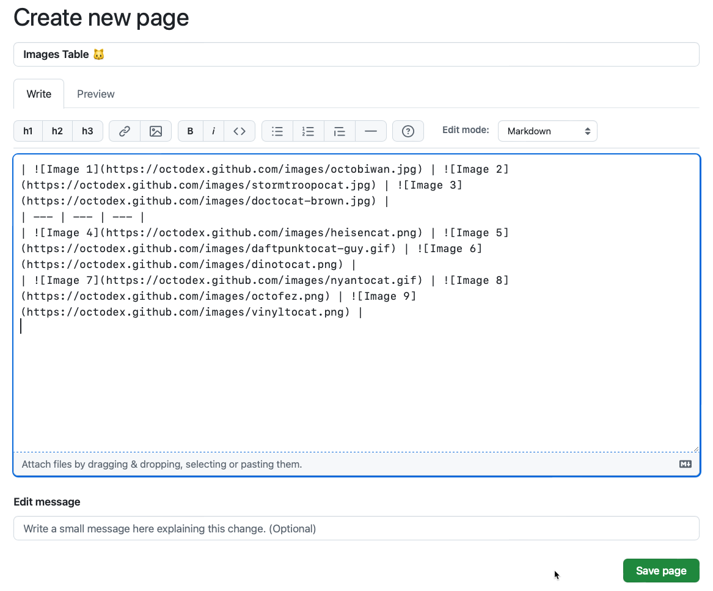
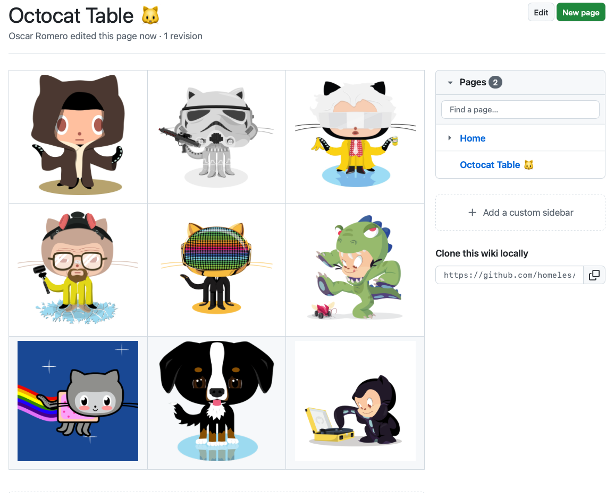

# 🔨 Hands-on: Create your Wiki

In this hands-on lab, you will learn how to create a Wiki for your repository or project

The lab contains the following sections:
- [🔨 Hands-on: Create your Wiki](#-hands-on-create-your-wiki)
  - [Creating the Wiki](#creating-the-wiki)
  - [Adding a 2nd page](#adding-a-2nd-page)
  - [Navigate Wikis](#navigate-wikis)
  - [Summary](#summary)

## Creating the Wiki

- [ ] Go to the `-> Wikis` Tab
- [ ] Click on **"Create the fist page"**




- [ ] add the below url to the Wikis page
    ``

    

- [ ] Click **Save**

## Adding a 2nd page

- [ ] Click on the top right `New Page` button
- [ ] Fill the below information in the wiki page:
  - [ ] Title: Octocat Table 🐱
  - [ ] Description:
```
|  |  |  |
| --- | --- | --- |
|  |  |  |
|  |  |  |
```
- [ ] Click **Save**



## Navigate Wikis

Now you can move between the wikis that you created and create a sidebar if you want



## Summary

In this hands-on lab you've practiced to work with GitHub Wikis, how to create and access them.

You can now continue with the next topic
