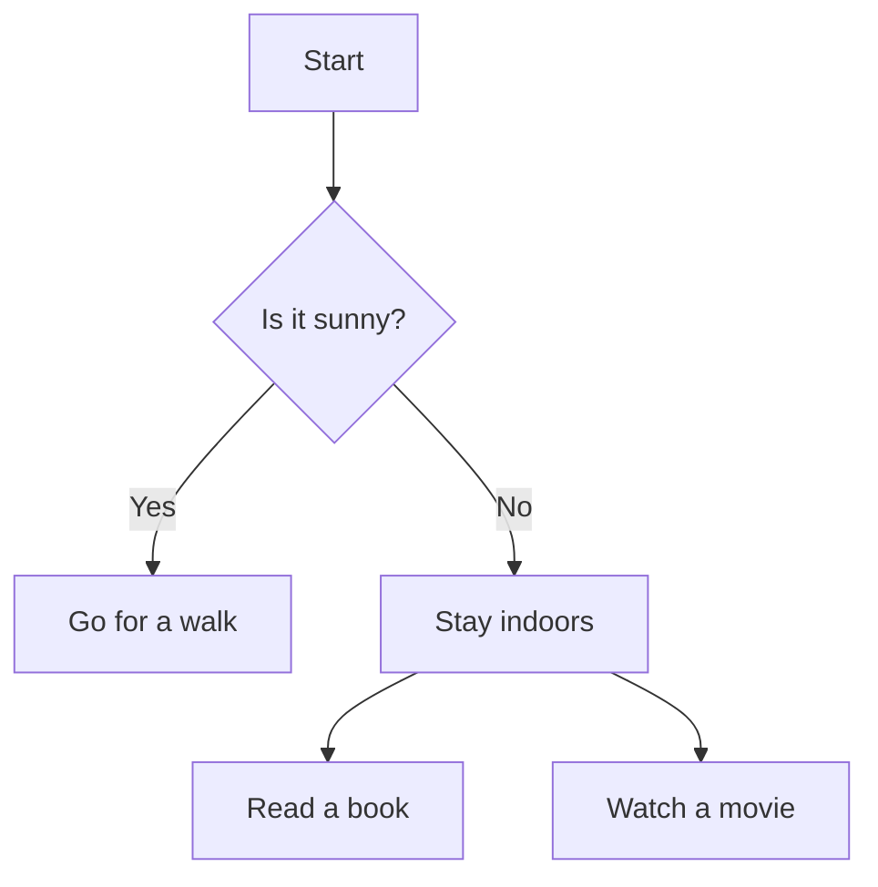
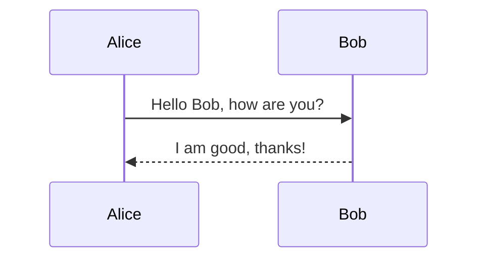
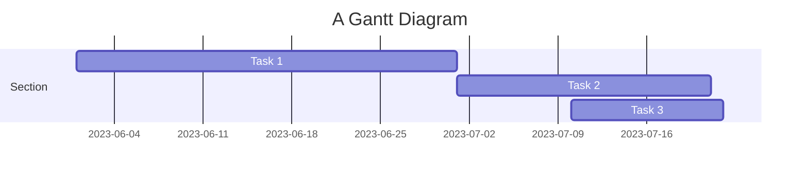
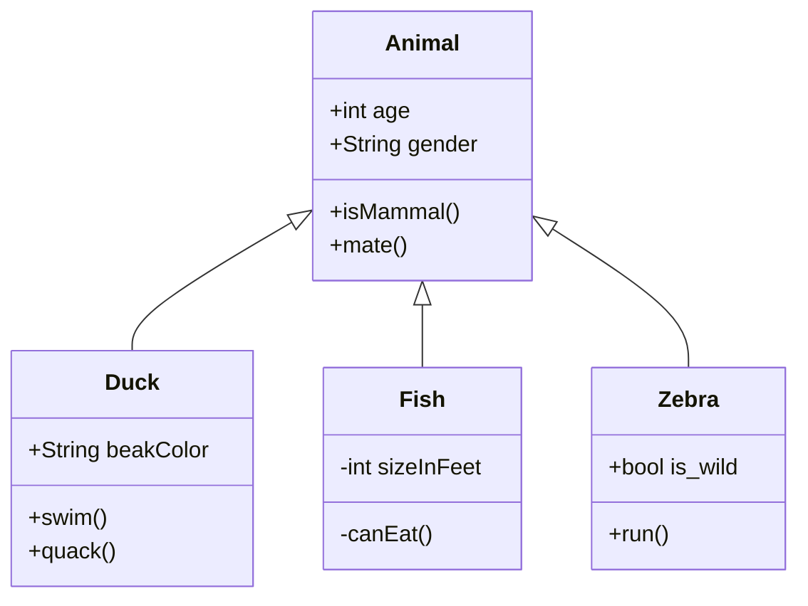

# GitHub Markdown Features and Syntax Examples

This document demonstrates various Markdown and GitHub-specific features including text formatting, task lists, links, images, Mermaid diagrams, mathematical expressions, and more.

---

## 1. Basic Markdown Syntax

### Headers

```markdown
# H1 Header
## H2 Header
### H3 Header
#### H4 Header
##### H5 Header
###### H6 Header
```

### Emphasis

```markdown
*Italic* or _Italic_
**Bold** or __Bold__
***Bold and Italic*** or ___Bold and Italic___
```

### Lists

#### Unordered List

```markdown
- Item 1
- Item 2
  - Subitem 2.1
  - Subitem 2.2
- Item 3
```

#### Ordered List

```markdown
1. First item
2. Second item
3. Third item
   1. Subitem 3.1
   2. Subitem 3.2
```

### Links

```markdown
[OpenAI](https://www.openai.com)
```

### Images

```markdown

```

### Blockquotes

```markdown
> This is a blockquote.
> It can span multiple lines.
```

### Code

#### Inline Code

```markdown
`inline code`
```

#### Code Blocks

```markdown
```
def hello_world():
    print("Hello, World!")
```
```

### Horizontal Rule

```markdown
---
***
___
```

### Tables

```markdown
| Header 1 | Header 2 |
|----------|----------|
| Cell 1   | Cell 2   |
| Cell 3   | Cell 4   |
```

### Task Lists

```markdown
- [x] Task 1
- [ ] Task 2
- [ ] Task 3
```

---

## 2. Mermaid Diagrams

### Flowchart



### Sequence Diagram



### Gantt Chart



### Class Diagram



---

## 3. GitHub-Specific Markdown Features

### Task Lists

```markdown
- [x] Task 1
- [ ] Task 2
- [ ] Task 3
```

### Mentions

```markdown
@octocat, please review this.
```

### Issue and Pull Request Links

```markdown
Fixes #123
See also #456
```

### Commit and Branch References

```markdown
Commit: `a1b2c3d`
Branch: `feature-branch`
```

### Emojis

```markdown
:smile: :+1: :shipit:
```

### Relative Links

```markdown
[Link to another file](./another-file.md)
```

### Footnotes

```markdown
Here is a footnote reference[^1].

[^1]: Here is the footnote.
```

---

## 4. Mathematical Expressions

### Inline Math

```markdown
The equation of a line is given by \( y = mx + b \).
```

### Block Math

```markdown
$$
E = mc^2
$$
```

### Quadratic Formula

```markdown
$$
x = rac{-b \pm \sqrt{b^2 - 4ac}}{2a}
$$
```

### Pythagorean Theorem

```markdown
$$
a^2 + b^2 = c^2
$$
```

### Euler's Formula

```markdown
$$
e^{i\pi} + 1 = 0
$$
```

### Summation

```markdown
$$
\sum_{i=1}^{n} i = rac{n(n + 1)}{2}
$$
```

### Integral

```markdown
$$
\int_{a}^{b} f(x) \, dx
$$
```

---

This document demonstrates various Markdown features, Mermaid diagrams, GitHub-specific syntax, and mathematical expressions.
